# 🛸 Virtual Pet Alien Zoo


## 👨‍🚀 Project Overview

**Virtual Pet Alien Zoo** is a full-stack project where users adopt, train, and sometimes eliminate rebellious alien creatures.  
The project was built as part of a backend specialization with **Java + Spring Boot** and a frontend developed with **V0** (React-based).

---

## ⚙️ Tech Stack

### Backend
- **Java 21**
- **Spring Boot 3**
- **Spring Security + JWT Authentication**
- **JPA + Hibernate**
- **MySQL (prod) / H2 (tests)**
- **Docker & Docker Compose**
- **Swagger / OpenAPI**
- **JUnit 5 + Mockito + WebTestClient (Integration & Unit tests)**

### Frontend
- **V0 (React-based framework)**
- **Custom pixel-art sprites and UI**
- **REST API integration with backend**

---

## 🌌 Features

- 👤 **Authentication & Authorization**
  - User registration & login
  - JWT-secured endpoints
  - Role-based access (`ROLE_USER`, `ROLE_ADMIN`)

- 🐾 **Pet Management**
  - Create, feed, and monitor alien pets
  - Pets have stats like **hunger**, **aggressiveness**, **status**
  - Multiple species with moods (Calm, Angry, Rebel)

- 🛠 **Admin Tools**
  - View all users
  - View/delete pets per user
  - Global statistics (users, pets, actives)

- 🧪 **Testing**
  - Unit tests (Mockito, JUnit5)
  - Integration tests (SpringBootTest + MockMvc)
  - Test profile with **H2 in-memory DB**

---

## 🗂️ System Architecture

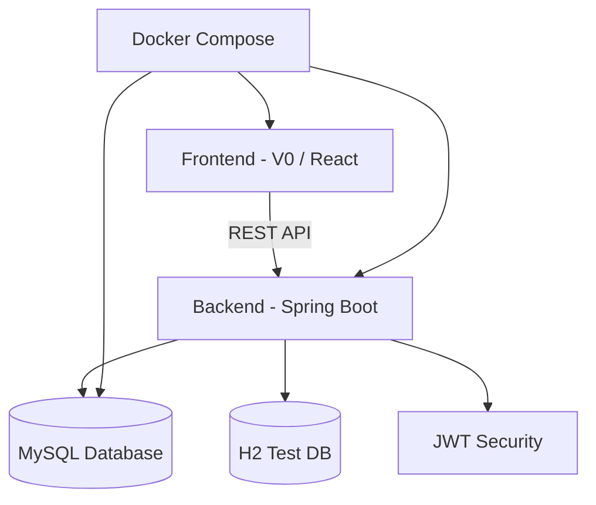

---

## 🐉 Alien Species

Each alien pet can evolve through moods and states.  

### 👽 Neuronoid
- Calm: 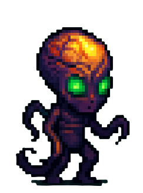
- Angry: 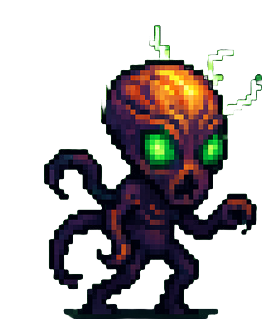
- Rebel: 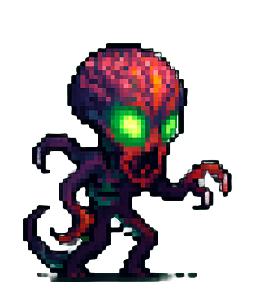

### 🐊 Predator
- Calm: 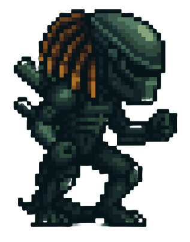
- Angry: 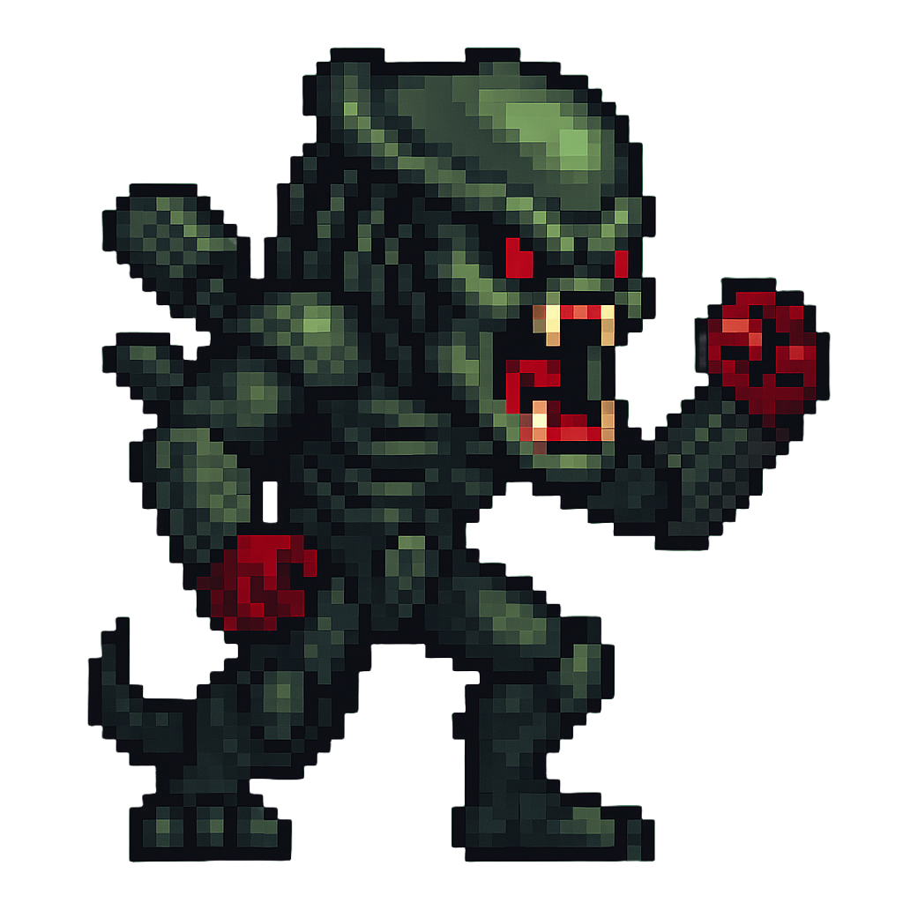
- Rebel: 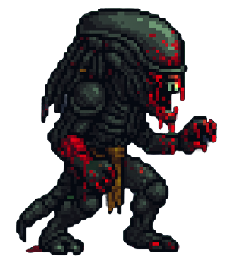

### 🧪 Spitter
- Calm: 
- Angry: 
- Rebel: 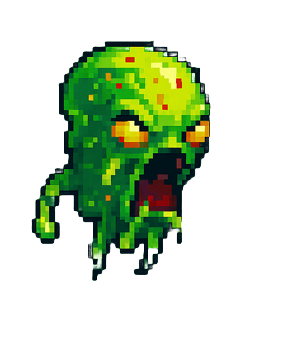

### 🕷 Xenomorph
- Calm: 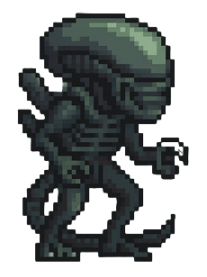
- Angry: 
- Rebel: 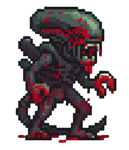

---

## 🧑‍🚀 The Commander & Control Center

- Commander:   
- Rock Astronaut: 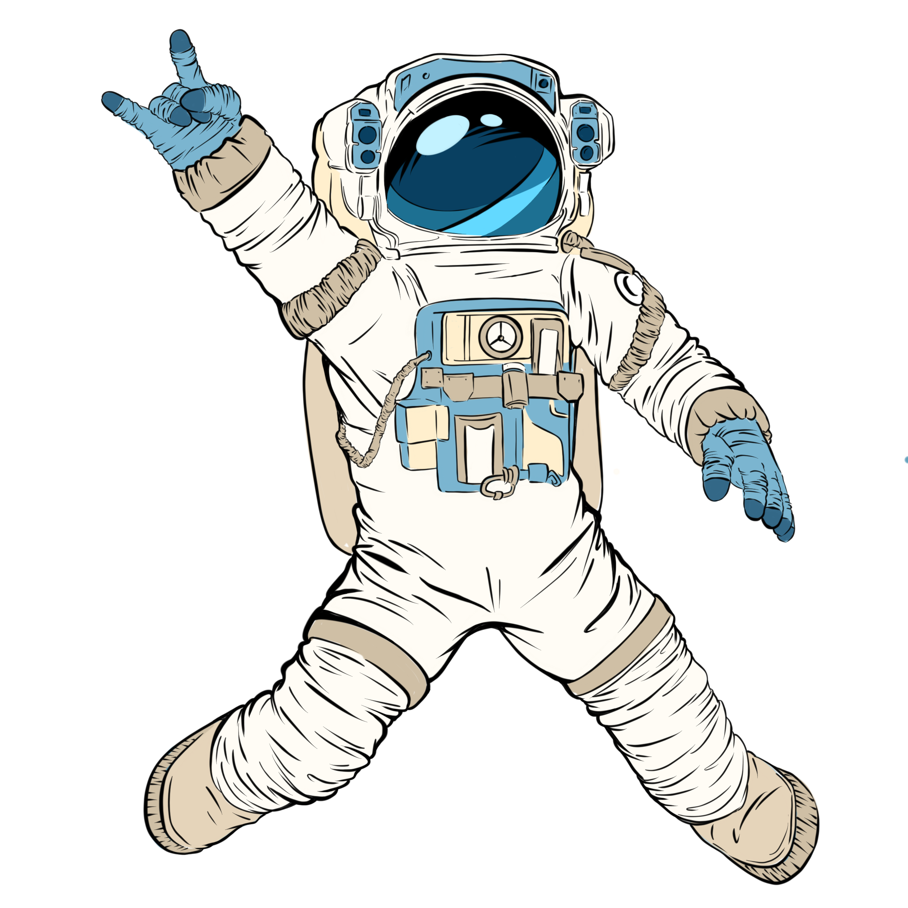  
- Control Center: 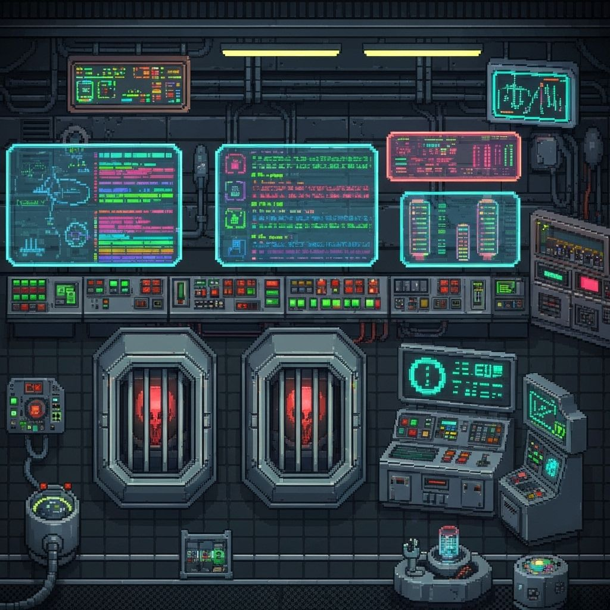  
- Spaceship Bridge: 

---

## 🔒 Security & Validation

- Strong password validation (must include uppercase, lowercase, digit, special character, min 8 chars).  
- JWT tokens required for all user & admin actions.  
- Reserved usernames (`admin`) are blocked.  

---

## 🐳 Docker Deployment

This project is fully **dockerized**:

- Backend container (Spring Boot + MySQL)
- Frontend container (V0 app)
- `docker-compose.yml` to orchestrate

```bash
# Build and run
docker compose up --build
```

---

## 📜 API Documentation

Swagger/OpenAPI available at:

```
http://localhost:8080/swagger-ui.html
```

---

## ✅ How to Run (Dev)

1. Clone repository
2. Start MySQL or use Docker
3. Run backend:
   ```bash
   mvn spring-boot:run
   ```
4. Run frontend (V0):
   ```bash
   npm run dev
   ```
5. Access the app at `http://localhost:3000`

---

## 🧪 Run Tests

```bash
mvn test
```

Uses H2 in-memory DB with isolated profile.

---

## 🌠 Screenshots

### Pets
  
  


### Scenes
  


---

## 🤝 Author

- **Ignasi Subirachs**  
  Backend Java Developer | Alien Tamer | Space Explorer 🚀

---
