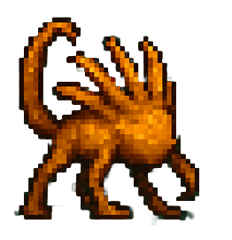
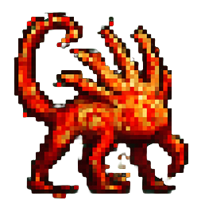
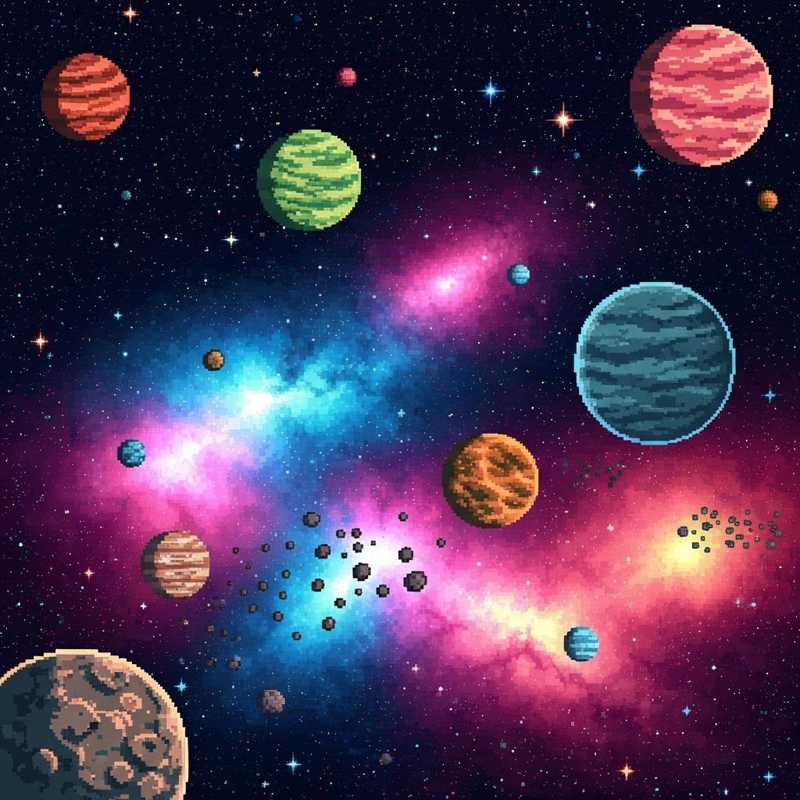

# 🛸 Virtual Pet Alien Zoo

## 👨‍🚀 Project Overview

**Virtual Pet Alien Zoo** is a full-stack project where users adopt, train, and sometimes eliminate rebellious alien creatures.  
The project was built as part of a backend specialization with **Java + Spring Boot** and a modern frontend developed with **Next.js**.

---

## ⚙️ Tech Stack

### Backend
- **Java 21**
- **Spring Boot 3**
- **Spring Security + JWT Authentication**
- **JPA + Hibernate**
- **MySQL (prod) / H2 (tests)**
- **Docker & Docker Compose**
- **Swagger / OpenAPI**
- **JUnit 5 + Mockito + WebTestClient (Integration & Unit tests)**

### Frontend
- **Next.js 15** (App Router)
- **React 18** with TypeScript
- **Tailwind CSS v4** (Utility-first styling)
- **shadcn/ui** (Component library)
- **Custom pixel-art sprites and UI**
- **Responsive design** (Mobile, Tablet, Desktop)
- **Google Fonts** (Orbitron, Exo 2)
- **REST API integration** with backend
- **Modern React patterns** (Server Components, Client Components)

---

## 🌌 Features

- 👤 **Authentication & Authorization**
  - User registration & login
  - JWT-secured endpoints
  - Role-based access (`ROLE_USER`, `ROLE_ADMIN`)

- 🐾 **Pet Management**
  - Create, feed, and monitor alien pets
  - Pets have stats like **hunger**, **aggressiveness**, **status**
  - Multiple species with moods (Calm, Angry, Rebel)

- 🛠 **Admin Tools**
  - View all users
  - View/delete pets per user
  - Global statistics (users, pets, actives)

- 🧪 **Testing**
  - Unit tests (Mockito, JUnit5)
  - Integration tests (SpringBootTest + MockMvc)
  - Test profile with **H2 in-memory DB**

---

## 🗂️ System Architecture

\`\`\`mermaid
flowchart TD
A[Frontend - Next.js / React] -->|REST API| B[Backend - Spring Boot]
B --> C[(MySQL Database)]
B --> D[(H2 Test DB)]
B --> E[JWT Security]
F[Docker Compose] --> A
F --> B
F --> C
\`\`\`

---

## 🐉 Alien Species

Each alien pet can evolve through moods and states.

### 👽 Neuronoid
- Calm: 
- Angry: 
- Rebel: 

### 🐊 Predator
- Calm: 
- Angry: 
- Rebel: 

### 🧪 Spitter
- Calm: 
- Angry: 
- Rebel: 

### 🕷 Xenomorph
- Calm: 
- Angry: 
- Rebel: 

---

## 🧑‍🚀 The Commander & Control Center

  

    
<strong>Commander:</strong>

    
  

  

    
<strong>Rock Astronaut:</strong>

    
  

  
<strong>Control Center:</strong>

  

  
<strong>Spaceship Bridge:</strong>

  

---

## 🔒 Security & Validation

- Strong password validation (must include uppercase, lowercase, digit, special character, min 8 chars).
- JWT tokens required for all user & admin actions.
- Reserved usernames (`admin`) are blocked.

---

## 🐳 Docker Deployment

This project is fully **dockerized**:

- Backend container (Spring Boot + MySQL)
- Frontend container (Next.js app)
- `docker-compose.yml` to orchestrate

\`\`\`bash
# Build and run
docker compose up --build
\`\`\`

---

## 📜 API Documentation

Swagger/OpenAPI available at:

\`\`\`
http://localhost:8080/swagger-ui.html
\`\`\`

---

## ✅ How to Run (Dev)

1. Clone repository
2. Start MySQL or use Docker
3. Run backend:
   \`\`\`bash
   mvn spring-boot:run
   \`\`\`
4. Run frontend (Next.js):
   \`\`\`bash
   npm run dev
   \`\`\`
5. Access the app at `http://localhost:3000`

---

## 🧪 Run Tests

\`\`\`bash
mvn test
\`\`\`

Uses H2 in-memory DB with isolated profile.

---

## 🌠 Screenshots

### Pet Faces

  
  
  

### Scenes

  
  

---

## 🤝 Author

- **Ignasi Subirachs**  
  Full-Stack Developer | Backend Java Specialist | Frontend Next.js Developer | Alien Tamer | Space Explorer 🚀

---
